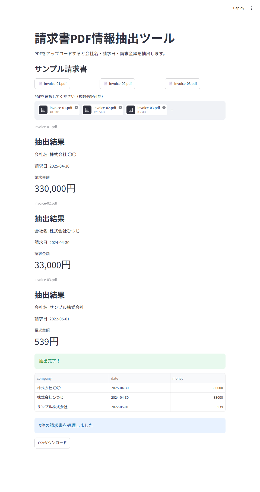
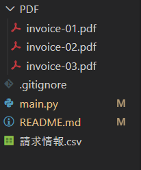
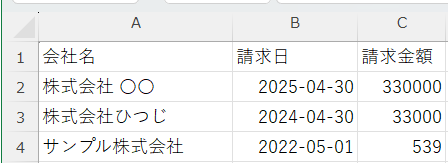

# 請求書PDF情報抽出ツール

## 特徴

- 複数の請求書PDFを一括処理
- 会社名・請求日・請求金額を自動抽出
- CSVファイルとしてダウンロード可能
- StreamlitによるWebアプリ化

## 概要

様々な書式の請求書PDFから会社名・請求日・請求金額を抽出し、CSVファイルへまとめるWebアプリです。
Streamlitを使用してブラウザ上で操作できるようにし、複数の請求書PDFを一括で処理できるようにしました。

## デモサイト

[アプリを開く](https://pdf-data-extractor-sswobjlyhzcuzcnbrnxjen.streamlit.app/)

## アプリ画面

## プロジェクト構成

## CSV出力結果

## 制作背景

請求書の内容を1ファイルずつ目視で確認し、Excelへ手入力する作業には時間がかかります。
そこで、請求書PDFから必要な情報を自動で抽出し、CSVへ出力することで転記作業の効率化を目的として開発しました。

## 主な機能

* PDFファイルを複数読み込み
* 会社名の抽出
* 請求日の抽出
* 請求金額の抽出
* CSVファイルとしてダウンロード
* サンプル請求書PDFのダウンロード

## 使用技術

* Python
* Streamlit
* PyMuPDF
* re（正規表現）
* csv
* os
* Git / GitHub

## 工夫した点

請求書PDFは発行元によってレイアウトが異なるため、複数のパターンに対応できるよう抽出ルールを実装しました。
また、開発当初は請求金額周辺の最大値を取得する方法を採用していましたが、請求書によっては登録番号や電話番号などの数値を誤って取得してしまう問題がありました。
そこで、請求金額の位置関係に着目し、「同じ行 → 次の行 → 周辺行」の順で探索する複数ルール方式へ改善しました。

### 会社名抽出

* 「御中」を含む行から会社名を抽出
* 「御中」が存在しない場合は「様」を含む行を探し、位置関係から会社名を推定

### 請求日抽出

* 「請求日: YYYY/MM/DD」形式
* 「請求日」の次行に日付が存在する形式

上記の複数パターンに対応し、最終的に YYYY-MM-DD 形式へ統一しています。

### 請求金額抽出

以下の順番で金額を探索することで、異なるレイアウトの請求書に対応しました。

1. 「請求金額」と同じ行にある金額を取得
2. 「請求金額」の次の行にある金額を取得
3. 「請求金額」周辺の情報から最大金額を推定

## 今後の改善点

* 和暦形式の日付への対応
* Excel（xlsx）形式での出力
* 抽出結果の表形式表示
* エラーメッセージの改善
* より多くの請求書フォーマットへの対応
